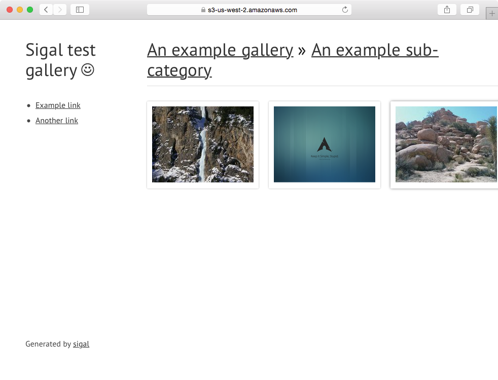

Sigal Demonstration of Hiram Pages
=======

This fork of Sigal has a few small changes to build and publish the sample gallery to a Hiram Pages Bucket.

The original project is at [https://github.com/saimn/sigal](https://github.com/saimn/sigal)

How to get sigal working in your bucket:

1. Install sigal
2. Install AWS CLI
3. Edit run-demo.sh use your bucket.  By default run-demo uses the tests/sample gallery.
4. Run *run-demo.sh*
5. Go to Hiram Pages to create an "HP Bridge Static Site" link

Screenshots
-------

These screenshots reflect what you should see:

We've also tested by uploading our favorite images from unsplash:

When this gallery is hosted on S3 and locked by Hiram Pages, only people you allow may view the photos.